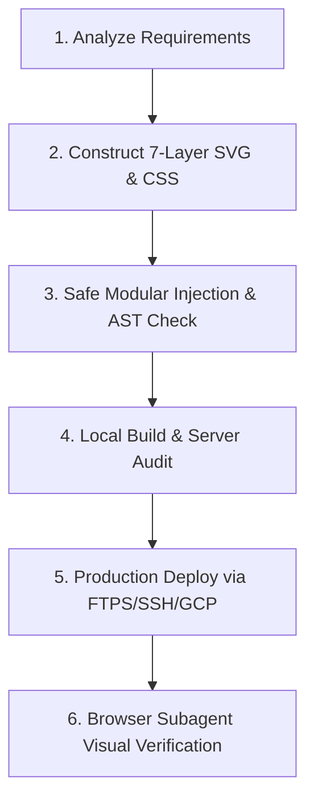

# Ambient Canvas Background Architect Skill

The **Ambient Canvas Background Architect** transforms simple user prompts (Topic + Desired Visual Elements) into production-grade, mesmerizing, 60fps GPU-accelerated animated backgrounds built exclusively with **100% Pure CSS and Inline SVG**.

It completely eliminates the performance drag of heavy 3D or JS canvas libraries (Three.js, Pixi, Canvas2D requestAnimationFrame loops) while delivering rich, cinematic, living backdrops.

---

## 1. The 7-Layer Visual Depth System (STRICT MANDATE)

Every generated background MUST follow this hierarchical 7-layer structure inside an `aria-hidden="true"` container with `pointer-events: none;`:

```
┌─────────────────────────────────────────────────────────────┐
│ 7. Atmospheric Micro-Particles (Twinkling dust/stars)       │
│ 6. Kinetic Cruisers (Moving jets, data packets, vehicles)    │
│ 5. Domain Anchor Modules (Radars, compasses, vaults, etc.)  │
│ 4. Dynamic Trajectory Curves (Animated dash flows, pulses)  │
│ 3. Telemetry & Coordinate HUD (Monospace technical stamps)  │
│ 2. Thematic Texture / Grid Pattern (80px dot-grid/matrix)   │
│ 1. Ambient Glow Orbs (Radial gradient blurs, filter: blur)  │
│ 0. Base Container & Theme Adaptive Backdrop                 │
└─────────────────────────────────────────────────────────────┘
```

### Layer Breakdown:
1. **Layer 1: Ambient Glow Orbs (`.ambient-orb`)**
   - 2 to 4 large circular divs positioned with negative margins (`width: 380px–520px; filter: blur(80px–100px);`).
   - Radial gradients using the palette's primary, secondary, and accent colors.
   - Smooth asynchronous floating keyframe animation (`orbFloat`, 12s–18s ease-in-out infinite alternate) with `will-change: transform`.
   - Separate opacity/gradient adjustments for dark mode vs light mode.

2. **Layer 2: Thematic Pattern & Grid Overlay (`<pattern>`)**
   - SVG `<defs>` pattern (default `80x80` or `60x60` px).
   - Subtle dot-intersections, isometric lines, circuit meshes, or coordinate crosshairs with low stroke opacity (`0.06`–`0.12`).

3. **Layer 3: Telemetry HUD Stamps (`<text>`)**
   - Monospace font (`font-family: ui-monospace, SFMono-Regular, Menlo, Monaco, Consolas, monospace; font-size: 8px–10px; fill: currentColor; opacity: 0.35–0.5;`).
   - Relevant domain data stamps placed in corners or strategic coordinates (e.g., GPS coordinates, FIR codes, METAR strings, live exchange rates, SHA hashes, system statuses).

4. **Layer 4: Trajectory Curves & Flow Lines (`<path>`)**
   - Cubic Bezier curves (`M ... C ...`) connecting narrative points across the canvas.
   - Underneath: Subtle static path (`opacity: 0.2–0.3`).
   - Overlay: Animated flowing dashed stroke (`stroke-dasharray: 8 16` or `10 18`) with `@keyframes flightFlowDash` (`to { stroke-dashoffset: -400px; }`) to simulate live electrical, flight, or currency transmission.
   - Waypoint pulse rings with expanding ripple keyframes (`pingRadar`).

5. **Layer 5: Domain-Specific Interactive Anchor Modules**
   - Standalone detailed vector illustrations anchored to corners or sides:
     * Rotating ATC 360° radar sweep beam with target blips.
     * Biometric fingerprint laser verification scanner.
     * Gyro compass dial with heading degrees.
     * Currency exchange node matrix ($ € ৳ ﷼).
     * Perspective runway with sequential approach rabbit lights.
     * Secure vault dial or blockchain ledger validator.

6. **Layer 6: Kinetic Cruising Entities**
   - Thematic silhouettes (jets, delivery drones, crypto blocks, shielded packets) animated along predefined arcs or bezier trajectories using `@keyframes` with `translate3d` and matching `rotate` angles.
   - Equipped with realistic blinking lights (navigation red/green, strobe white, or data transfer pings).

7. **Layer 7: Atmospheric Dust & Micro-Sparkles**
   - 6–12 tiny SVG circles (`r: 1.0–1.6`) scattered across negative space with staggered opacity/scale twinkle animations.

---

## 2. Foreground Contrast & Readability Protocol (WCAG AAA)

A background is a complete failure if it degrades foreground readability. Always enforce the **Dual-Shielding Protocol**:

### A. Ultra-Sheer Frosted Glass Content Card
Wrap the foreground container or hero card with:
```css
/* Tailwind Class Equivalent */
bg-white/[0.04] sm:bg-white/[0.07] dark:bg-[#06140e]/[0.10]
border border-slate-300/40 dark:border-emerald-500/20
rounded-3xl p-6 sm:p-8 shadow-xl
backdrop-blur-[4px] sm:backdrop-blur-[6px]
```
*Why this works:* Low alpha (`0.04`–`0.10`) keeps the background graphics, animated paths, and radar passes clearly visible through the card, while the light `backdrop-blur-[4px]` diffuses high-frequency visual noise behind text.

### B. 100% Solid Pill/Capsule Enclosures for Critical Text
Never render naked text directly over high-contrast animated lines:
- **Headings & Keylines:** Wrap in capsule spans (`bg-white/95 text-slate-900 dark:bg-[#041a10]/95 dark:text-emerald-50 border border-slate-300/80 dark:border-emerald-500/30 px-3.5 py-1 rounded-xl shadow-md`).
- **Eyebrow Badges:** High-contrast pill (`bg-white/95 dark:bg-emerald-950/90`).
- **Description / Sub-headline:** Glass container with high background opacity (`bg-white/95 dark:bg-[#03140d]/90`).
- **CTAs:** Solid high-contrast buttons (`shadow-lg`).

---

## 3. Supported Industry & Domain Themes

Map user topics instantly to this visual motif blueprint:

| Industry / Topic | Anchor Modules & Motifs | Color Tokens (Light / Dark) | Telemetry HUD Examples |
| :--- | :--- | :--- | :--- |
| **Aviation & Travel** | ATC Radar sweep, runway approach rabbit lights, gyro compass, cabin window with drifting clouds, cruising jets with contrails | Sky `#0284c7`, Emerald `#10b981`, Amber `#f59e0b` / Slate `#041a10` | `DAC [23°50'N 90°24'E] · FIR: VGHS`, `ALT: FL380 HDG: 284°` |
| **Fintech, Remittance & Expatriate Banking** | Global remittance curves, currency exchange nodes ($ € ৳ ﷼ AED SAR), live rate ticker graph, blockchain ledger chain, smart vault dial | Gold `#d97706`, Emerald `#059669`, Cyan `#0891b2` / Dark Green `#03160e` | `FX: USD/BDT 121.50 · SAR/BDT 32.40`, `LEDGER: BLOCK #849204 VALIDATED` |
| **Passport, Visa, BMET & Immigration** | World route arcs, biometric fingerprint scanner laser, official seal watermark, embassy gate portal, departure card lines | Indigo `#4f46e5`, Teal `#0d9488`, Amber `#d97706` / Dark Navy `#060d1f` | `BMET NO: 2026/89401 · SMART CARD READY`, `EMBASSY CLEARANCE: APPROVED` |
| **Tech, SaaS, Cloud & DevSecOps** | Hexagonal cluster, glowing packet router, cybersecurity shield with pulse waves, server rack blinkers, binary terminal stream | Cyan `#06b6d4`, Violet `#7c3aed`, Emerald `#10b981` / Dark Slate `#020617` | `IP: 192.168.1.1 · LATENCY: 12ms`, `TLS 1.3 SECURE · ZERO LEAKS` |
| **Medical, Healthcare & Pharma** | Living ECG heartbeat rhythm, DNA double-helix nodes, cellular pulse aura, cross-hair focal scope | Cyan `#0ea5e9`, Rose `#e11d48`, Emerald `#10b981` / Dark Teal `#03181a` | `BPM: 72 NORMAL · SPO2: 99%`, `GAMCA TEST STATUS: FIT (CLEARED)` |
| **E-Commerce & Logistics** | Dynamic cargo container routes, global shipping vessels, parcel barcode scan laser, speed velocity vectors | Orange `#ea580c`, Blue `#2563eb`, Amber `#f59e0b` / Deep Charcoal `#0f172a` | `TRACKING: BD-98234-EXP · AIR FREIGHT`, `STATUS: IN TRANSIT / CUSTOMS` |

---

## 4. Anti-Corruption & Safe Code Injection Protocols (CRITICAL)

> [!CAUTION]
> **LESSON FROM PRODUCTION OUTAGES:**
> Never perform blind, wide-range string replacements (`replace_file_content`) inside large, monolithic builder scripts (Python, Node, PHP). Blind replacements can wipe out hundreds of lines of code, corrupt AST syntax, delete function definitions (`def build_homepage():`), orphan dictionary keys, and cause unrecoverable syntax errors.

When integrating an Ambient Canvas Background into a codebase, **ALWAYS classify the target environment into one of two archetypes and enforce strict safety gates:**

### Archetype A: Static / Framework Files (HTML, Astro, React, Vue)
- Generate a standalone modular component file (e.g., `src/components/AeroAmbientCanvas.astro` or `components/RemittanceAmbientBg.tsx`).
- Or in pure static HTML (`index.html`), place the SVG inside an explicit marker:
  ```html
  <!-- AMBIENT_CANVAS_START -->
  <div class="ambient-canvas-wrapper" aria-hidden="true">
    ...
  </div>
  <!-- AMBIENT_CANVAS_END -->
  ```
- Keep all styles in the canonical stylesheet (e.g., `assets/css/index.css`) under a dedicated namespaced comment block `/* --- AMBIENT CANVAS SYSTEM --- */`.

### Archetype B: Monolithic Generator Scripts (e.g., `build_homepage.py`, `generate_site.js`)
If the HTML is generated dynamically by a script:
1. **Never dump 300+ lines of raw SVG directly into the middle of a complex script logic block.**
2. **Use Modular File Extraction or Helper Functions:**
   - Put the SVG markup in a separate helper function (e.g., `def render_ambient_canvas_svg():`) or an external template file (`assets/svg/hero_ambient_canvas.html`).
   - The generator script then simply calls `render_ambient_canvas_svg()` or `Path("assets/svg/hero_ambient_canvas.html").read_text(encoding="utf-8")`.
3. **Escaping Protocol for Template Literals & f-strings:**
   - In Python `f"""..."""`, raw curly braces in CSS or inline styles (`style="fill: url(#...)"`) MUST be escaped as `{{` and `}}`. Failure to escape causes immediate `ValueError: f-string: single '}' is not allowed`.
   - Prefer regular raw multi-line strings (`r"""..."""`) or dedicated `.html` files over f-strings for SVG markup.
4. **Pre-Edit Backup & AST Syntax Validation Gate:**
   - Before executing any edit on a generator script: create a temporary backup or ensure git clean state.
   - Immediately after editing: execute a syntax validation command:
     * Python: `python -m py_compile <script_path>`
     * Node.js: `node -c <script_path>`
   - If syntax verification fails: **REVERT IMMEDIATELY** before attempting to run builds or deploy.

---

## 5. Host Runtime & Environment Execution Rules (Windows Workstation)

When running commands on the user's Windows development environment:
1. **Python Command Resolution:**
   - Direct `python` or `py` commands on this host may fail with `ModuleNotFoundError: No module named 'encodings'`.
   - **MANDATORY RUNTIME:** Always use the Google Cloud SDK bundled Python runtime or `uv`:
     ```powershell
     & "C:\Users\arham\AppData\Local\Google\Cloud SDK\google-cloud-sdk\platform\bundledpython\python.exe" <path_to_script>
     ```
     Or:
     ```powershell
     uv run python <path_to_script>
     ```
2. **PowerShell Inline Quoting Hazard:**
   - Never run multiline inline Node.js or Python code directly in PowerShell via `node -e "..."` with nested quotes or `<` / `>` characters (PowerShell intercepts `<` as file redirection).
   - Always write a temporary script into `scratch/<temp_task>.js` or `scratch/<temp_task>.py` and execute:
     ```powershell
     node scratch/<temp_task>.js
     ```
   - Clean up scratch scripts once verified.

---

## 6. End-to-End Execution Workflow

Execute these 6 steps autonomously from prompt to live verification:



### Step 1: Input & Container Analysis
Extract:
- **Target Container:** (Hero section, card backdrop, modal).
- **Domain Topic:** (Fintech, Aviation, BMET/Passport, DevSecOps, Medical).
- **Target Framework:** (Static HTML, Astro, Python builder, WordPress).

### Step 2: SVG Canvas Blueprint Architecture
Design responsive SVG `viewBox="0 0 1440 640"` (or `0 0 1440 800`) with `preserveAspectRatio="xMidYMid slice"`.
- Clean `<defs>` for gradients, radar sweeps, and patterns.
- Hardware-accelerated CSS animations using `transform: translate3d(x, y, 0) rotate(...)`.
- Add `@media (prefers-reduced-motion: reduce)` for full accessibility.

### Step 3: Safe Injection & Syntax Gate
- Apply the Archetype A or Archetype B injection protocol.
- Separate CSS into the canonical stylesheet (`assets/css/index.css`) with namespaced classes (`.ambient-*`).
- Run AST syntax check (`py_compile` or `node -c`).

### Step 4: Local Build & Server Audit
- Run the site generator or local dev server.
- Confirm zero build errors and zero layout shifts.

### Step 5: Production Deployment Protocol
- Identify deployment credentials (e.g. FTPS TLS to production host via `deploy_*.py` or Firebase Hosting).
- Deploy all updated artifacts (`index.html`, `assets/css/index.css`, images).
- Use cache-busting query strings (`?v=live_hero_ambient_...`) to verify real live responses.

### Step 6: Visual Browser Subagent Verification Gate
- Run `browser_subagent` on the live or local URL.
- Audit requirements:
  * Check for 60fps GPU acceleration.
  * Check contrast against WCAG AAA standards.
  * Verify 0 console errors (`console.error`).
  * Verify mobile responsiveness (`max-width: 1024px` and `max-width: 640px` hide or scale dense anchor modules).
  * Capture visual screenshot artifact for the user.

---

## 7. Standard Component Reference Template

```html
<!-- Ambient Canvas Vector Background (100% Pure CSS + Inline SVG) -->
<div class="ambient-canvas-wrapper" aria-hidden="true">
  <!-- Layer 1: Ambient Glow Orbs -->
  <div class="ambient-orb ambient-orb-primary"></div>
  <div class="ambient-orb ambient-orb-secondary"></div>
  <div class="ambient-orb ambient-orb-accent"></div>

  <!-- Layer 2-7: Master SVG Canvas -->
  <svg
    class="ambient-svg-canvas"
    viewBox="0 0 1440 640"
    fill="none"
    xmlns="http://www.w3.org/2000/svg"
    preserveAspectRatio="xMidYMid slice"
  >
    <defs>
      <!-- Gradients, Radar Sweep Sectors, Patterns -->
      <pattern id="ambientDotGrid" width="60" height="60" patternUnits="userSpaceOnUse">
        <circle cx="30" cy="30" r="1.2" fill="currentColor" opacity="0.08" />
      </pattern>
      <linearGradient id="flowTrailGrad" x1="0%" y1="0%" x2="100%" y2="100%">
        <stop offset="0%" stop-color="#10b981" stop-opacity="0" />
        <stop offset="50%" stop-color="#10b981" stop-opacity="0.8" />
        <stop offset="100%" stop-color="#059669" stop-opacity="0" />
      </linearGradient>
    </defs>

    <!-- Layer 2: Grid Texture -->
    <rect width="100%" height="100%" fill="url(#ambientDotGrid)" class="ambient-grid-layer" />

    <!-- Layer 3: Telemetry HUD Data -->
    <g class="ambient-telemetry" font-family="monospace" font-size="9" fill="currentColor" opacity="0.4">
      <text x="40" y="50">SYS: ACTIVE · NODE: GLOBAL-HUB</text>
      <text x="1240" y="50" text-anchor="end">LATENCY: 12ms · SECURE TLS 1.3</text>
    </g>

    <!-- Layer 4: Dynamic Flow Trajectories -->
    <path d="M 120 480 C 400 200, 900 600, 1320 220" stroke="currentColor" stroke-width="1.5" stroke-opacity="0.15" />
    <path d="M 120 480 C 400 200, 900 600, 1320 220" stroke="url(#flowTrailGrad)" stroke-width="2.5" stroke-linecap="round" class="ambient-flow-dash" />

    <!-- Layer 5: Domain Anchor Modules (e.g. Radar Scanner) -->
    <g class="ambient-anchor-module" transform="translate(1220, 360)">
      <circle r="70" stroke="currentColor" stroke-width="1" stroke-opacity="0.12" />
      <circle r="45" stroke="currentColor" stroke-width="1" stroke-opacity="0.08" />
      <line x1="-70" y1="0" x2="70" y2="0" stroke="currentColor" stroke-width="1" stroke-opacity="0.1" />
      <line x1="0" y1="-70" x2="0" y2="70" stroke="currentColor" stroke-width="1" stroke-opacity="0.1" />
      <circle cx="0" cy="0" r="70" class="ambient-radar-sweep" />
    </g>

    <!-- Layer 6: Kinetic Entity -->
    <g class="ambient-cruiser" transform="translate(680, 340)">
      <circle r="3.5" fill="#10b981" />
      <circle r="8" stroke="#10b981" stroke-width="1.5" class="ambient-pulse-ring" />
    </g>

    <!-- Layer 7: Atmospheric Dust Micro-Sparkles -->
    <circle cx="280" cy="160" r="1.2" fill="currentColor" class="ambient-sparkle" />
    <circle cx="840" cy="480" r="1.5" fill="currentColor" class="ambient-sparkle ambient-delay-1" />
    <circle cx="1060" cy="180" r="1.0" fill="currentColor" class="ambient-sparkle ambient-delay-2" />
  </svg>
</div>
```

```css
/* --- AMBIENT CANVAS STYLESHEET TOKENS --- */
.ambient-canvas-wrapper {
  position: absolute;
  inset: 0;
  width: 100%;
  height: 100%;
  overflow: hidden;
  pointer-events: none;
  user-select: none;
  z-index: 0;
}

.ambient-orb {
  position: absolute;
  border-radius: 9999px;
  filter: blur(90px);
  pointer-events: none;
  will-change: transform;
  animation: ambientOrbFloat 16s ease-in-out infinite alternate;
}

.ambient-svg-canvas {
  position: absolute;
  top: 0;
  left: 50%;
  transform: translateX(-50%);
  width: 100%;
  height: 100%;
  min-width: 1200px;
  max-width: 1920px;
}

.ambient-flow-dash {
  stroke-dasharray: 12 24;
  animation: ambientDashFlow 10s linear infinite;
}

@keyframes ambientDashFlow {
  to { stroke-dashoffset: -360px; }
}

@keyframes ambientOrbFloat {
  0% { transform: translate3d(0, 0, 0) scale(1); }
  50% { transform: translate3d(30px, -25px, 0) scale(1.08); }
  100% { transform: translate3d(-25px, 25px, 0) scale(0.94); }
}

@media (prefers-reduced-motion: reduce) {
  .ambient-orb, .ambient-flow-dash, .ambient-radar-sweep, .ambient-pulse-ring, .ambient-sparkle {
    animation: none !important;
  }
}
```

---

## 8. Quality Gate & Self-Correction Checklist

Before completing any ambient canvas task, confirm each item:
- [ ] **Zero JavaScript Overhead:** Built 100% with Pure CSS and Inline SVG.
- [ ] **GPU Accelerated:** Only `translate3d`, `rotate`, `scale`, and `opacity` used in keyframes.
- [ ] **Dual-Shielding Active:** Foregrounds have frosted glass + 100% solid text pill containers.
- [ ] **Safe Code Injection:** No blind replacements in generator scripts; AST validated (`py_compile` / `node -c`).
- [ ] **Windows Runtime Respected:** Bundled Python / `uv` used; temporary scripts used in `scratch/`.
- [ ] **Live Verified:** Deployed to production and verified with `browser_subagent` (0 console errors).
